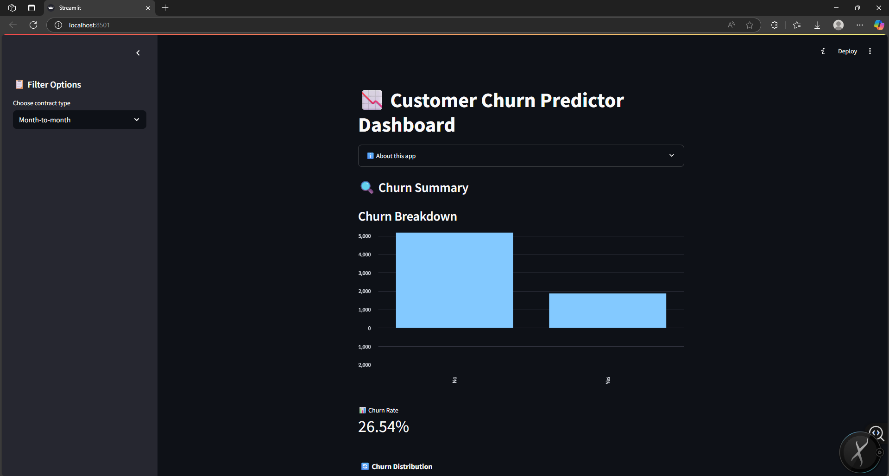
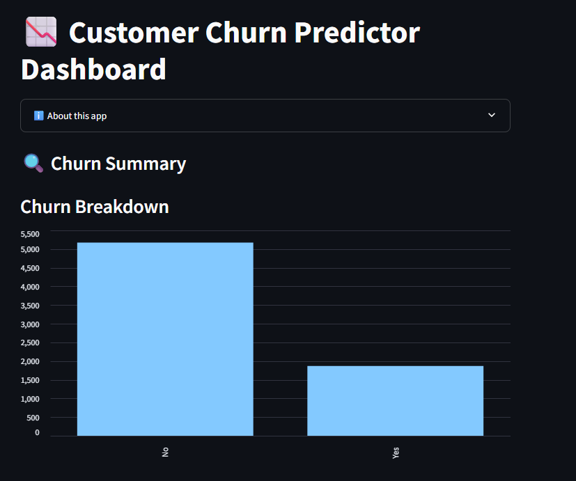
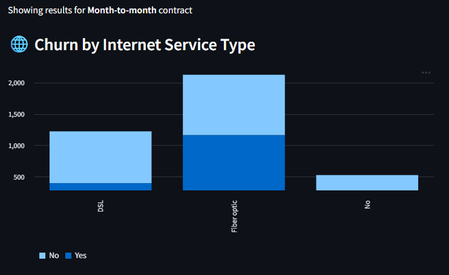
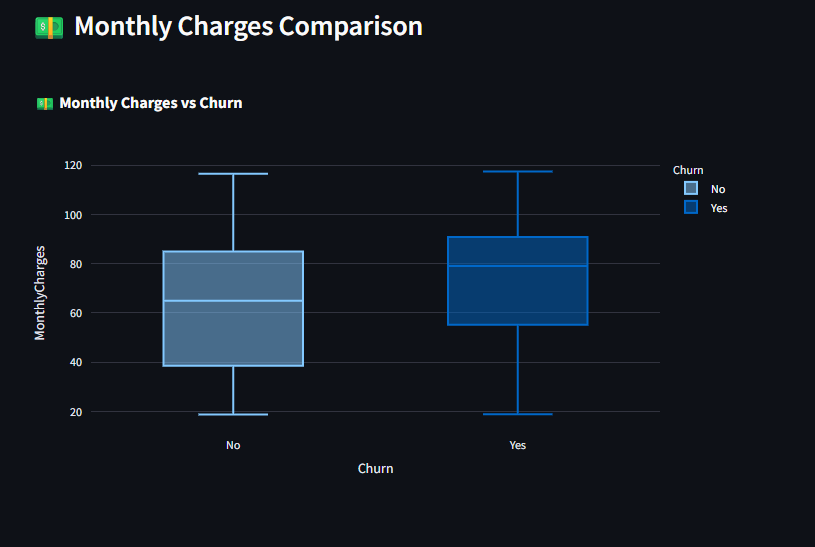
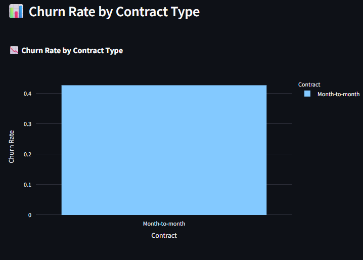
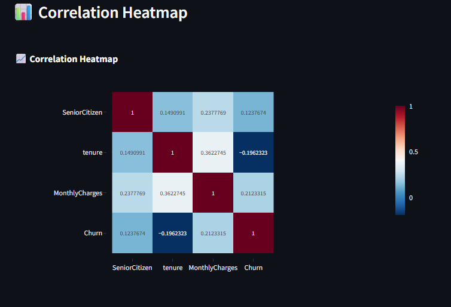

# 📉 Customer Churn Predictor Dashboard




An interactive Streamlit dashboard that visualizes churn behavior in the Telco industry using real-world customer data. Gain insights into churn patterns, contract types, internet services, and more — with downloadable insights.

---

## 🔍 Key Features & Insights

- 📊 **Churn Summary**: Total churn breakdown and live churn rate metric  
- 📋 **Filter by Contract Type**: Explore churn behavior across contract types  
- 🌐 **Churn by Internet Service**: Visualizes churn across DSL, Fiber, and No Service  
- 💵 **Monthly Charges Comparison**: Box plot comparing churn vs non-churn customer bills  
- 📉 **Churn Rate by Contract Type**: Understand which contracts lead to more churn  
- 📶 **Churn Rate by Internet Service**: Compare churn likelihood by service  
- 📈 **Correlation Heatmap**: Detect correlations between numerical features & churn  
- 📥 **Download Filtered Dataset + Insights**: Export data and charts as CSVs

---

## 🖼️ Dashboard Previews

> 📁 Make sure these screenshots exist inside the `assets/` folder

-   
-   
-   
-   
- 

---

## 🚀 How to Run Locally

1. **Clone this repository:**
   ```bash
   git clone https://github.com/taqi-jpg/customer-churn-dashboard.git
   cd customer-churn-dashboard

2. **Install dependencies:**
    bash

    pip install -r requirements.txt

3. **Run the app:**
    streamlit run churn_dashboard.py

☁️ Live App
Deployed on Streamlit Cloud
🔗 View Live Dashboard


📌 Dataset Info
Source: Telco Customer Churn Dataset (IBM Sample)
Features Include: Contract type, Monthly Charges, Internet service, Payment methods, and Churn labels


🔗 Links
*📂 GitHub Repository

*📊 Live Streamlit App

✨ Author
Built with ❤️ by Mohammed Taqiuddin Faraz

*🔗 LinkedIn

*🔗 GitHub

📧 Reach me at: mail2mtf@gmail.com

